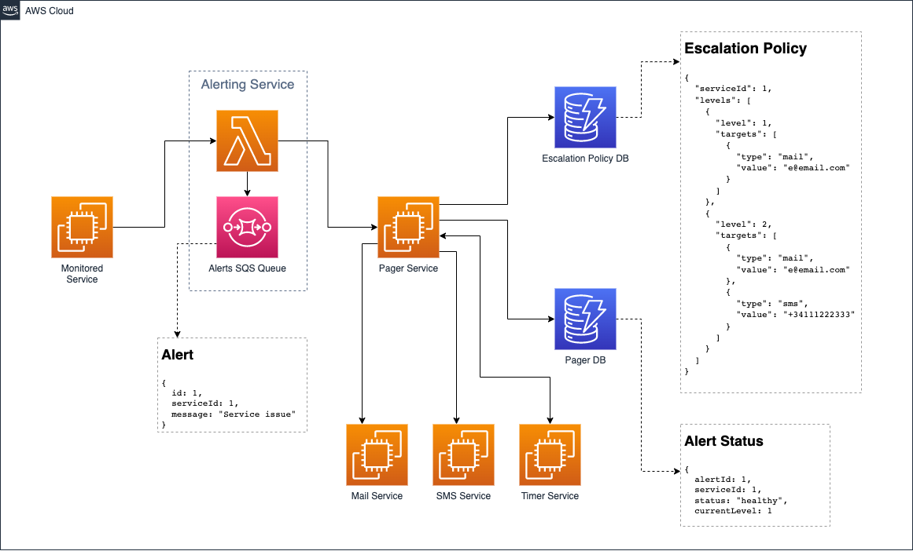

# Alert System (AirCall)

Minimal prototype for an Alerting System

## Architecture Overview


## Setting up

After cloning the repository, install the dependencies: 
```
npm install
```

## How to test

From the root folder:
```
npm test
```

## AWS Architecture Prototype

